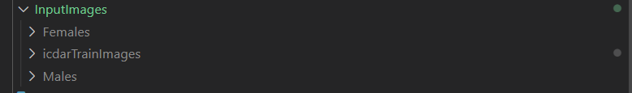

# Guidelines To Run Project

### if you want to extract the cold and hinge features you need to:

- create folders Female and put inside the cmp Females pics
- create folders Males and put inside the cmp Males pics
- create folders icdarTrainImages and put inside the icdar train pics
- put the pic directly not inisde another folder



## To Run Tunning & predict module

```
python .\2.Cold_Hinge_Approach\main.py
```

## To Run predict module

- First set ENV argument (TESTDIR) & (OUTDIR)

### if you use CMD

```
set TESTDIR=${Your dir}
set OUTDIR=${Your dir}
```

### Then rum predict module

```
python predict.py
```
